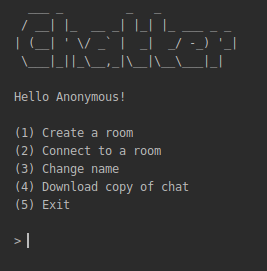

# Simple Java Chat Application

This application was a project-exam collaboration that showcases certain Java topics. The highlighted topics were Loops, Arrays, Methods, and File I/O. The challenge here was to create a unique application to avoid the deduction of points. Fortunately, this project got a perfect score of 100.



I implemented our current topic in PHP, Handling Requests. The PHP website will serve as a **server** to accept requests from the clients. It will create text files and implement changes to it. The text file is the chat room that holds the messages. It will then be read line by line by the Java application.

> No security implementations were added

## Configuration

### Server
First and foremost we should create a server (Website). The website should have:

 1. index.php
 2. txt/
 
The index.php file can be found in *project/server/*. Upload it into your public_html folder and create a *txt* folder alongside the index.php.

### Java Application
In the Main.java [line](https://github.com/AlecBlance/Simple-Java-Chat-Application/blob/55be59cd593545de63ed36ca2b240378776226e7/src/Main.java#L19), the domain variable needs to be changed. Just put your website's domain that holds the index.php.

E.g.
```java
public static String name = "Anonymous", room = "", domain = "http://alecblance.com/";
```

## Running
Head over to your java application and run it. 
The first step should be creating a room. After that, you may play with the commands and settings.

**Room Commands**
> /b - Back to Menu
> /s - Saving room to your local computer
> /r - Refresh

## Built with
[Java](https://www.java.com/en/) - Programming Language
[PHP](https://www.php.net/) - Programming Language

## Author

 - Alec Blance 
 - Almira Ruby Montalvo
## License
This project is licensed under the MIT License - see the [LICENSE](LICENSE) file for details
## Acknowledgements
 - Niel Bunda - Teacher


